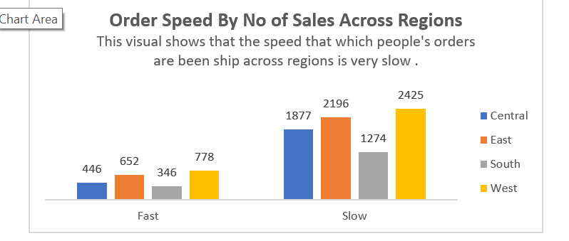

# Superstore Sales Analysis

## Introduction

This is an Excel project of sales analysis of a store called Superstore. The project is to analysis and derive insights to answer important questions for better business decision making. 
**_Disclamier_**:_All Dataset do not represent any individual,institution or company ,but just a dummy set to demonstrate my knowledge of Excel._

## Problem Statement

1.Total Revenue made in each category.
2. Average Profit Made in each Sub-category.
3. Profit margin by each segment.
4. Number of sales made in each regions.
5. The speed of processing the order good for delivery.
6. The order month with most profit.
7. Top 10 product with most profit.
8. Top 5 state that generated most revenue.

## Skill /Concept documented:
These are the Excel Features Incorporated:
-	Power Query editor
-	Excel Formular
-	Pivot Table
-	Pivot Chart

 ## Data Modelling
The Data has 9995 rows and 21 columns. The data was loaded on the power query editor, were some data cleaning was done and a column was added named order processing time (Shipping Time-Order Time). 
The data was then loaded back to the excel worksheet were column(Order month was added; =TEXT([@[Order Date]],"mmmm") and column(Order Processing Speed; =IF([@[Order Processing Time]]<3,"Fast","Slow") was added. We then load into the pivot table were the analysis was done.

## Data Analysis and Visualization

# Total Revenue made in category
Analysis                                                            |     Visuals
:-------------------------------------------------------------:    |    :-------------------------------------------------------------:
                                    |       

# Average Profit Made in each SubCateroy
Analysis                                                            |     Visuals
:-------------------------------------------------------------:    |    :-------------------------------------------------------------:
                                    |       

# Profit Margin for eaech Segment

Analysis                                                            |     Visuals
:-------------------------------------------------------------:    |    :-------------------------------------------------------------:
                                    |       

# Number of Sales made in each region

Analysis                                                            |     Visuals
:-------------------------------------------------------------:    |    :-------------------------------------------------------------:
                                    |       

# The speed of processing the order good for delivery.

Analysis                                                            |     Visuals
:-------------------------------------------------------------:    |    :-------------------------------------------------------------:
                                    |       

# The order month with most profit.

Analysis                                                            |     Visuals
:-------------------------------------------------------------:    |    :-------------------------------------------------------------:
                                    |       

# Top 10 product with most profit.

Analysis                                                            |     Visuals
:-------------------------------------------------------------:    |    :-------------------------------------------------------------:
                                    |       

# Top 5 state that generated most revenue.
   
Analysis                                                            |     Visuals
:-------------------------------------------------------------:    |    :-------------------------------------------------------------:
                                    |       

## Conclusion and Recommendation
This data set shows that the time been goods ordered is been shipped is very slow, this might make customer to be very discourage to order from the company.
	There is a significant Loss in the sell of Tables, why there is a wide margin in the profit made in copiers that other products. Technology generally generates more revenue.
	The consumers segment has the most profit margin, so consumers segment should be prioritize. 

